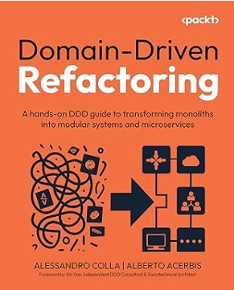

# Hi, I'm Alberto 👋 🚴🏃⛷ 🧗‍♂️💻

## 🌎 Find me around the web

- Speaking in public conference <a href="https://sessionize.com/alberto-acerbis8252/" target="_blank">Sessionize</a> 🎦
- Sharing updates on <a href="https://www.linkedin.com/in/aacerbis/">LinkedIn</a> 💼
- My site: <a href="https://www.albertoacerbis.com/" target="_blank">www.albertoacerbis.com</a>

## ✨ Current situation

- 🔭 I’m currently working as Software Architect at Intré
- 🌱 I’m currently learning Advanced Software Architectural Patterns
- 📙 I co-authored a **book** about **Domain-Driven Desing** with **[Avanscoperta](https://leanpub.com/cronache-di-domain-driven-design)**
- 📙 I co-authored a **book** about **Domain-Driven Refactporing** with **[Packt](https://www.packtpub.com/en-us/product/domain-driven-refactoring-9781835889107)**
- 📙 I wrote some **articles** about **Software Architecture, Microservices, DDD, Test** for **[Mokabyte](https://www.mokabyte.it/autore/alberto-acerbis/)**
- 🧙‍♂️ I released a course "**[Introduzione a DDD, CQRS](https://agilereloaded.it/corsi/corso-ddd-cqrs-pattern/)**" on **Domain-Drive Design**
- 🚴🏃⛷ 🧗‍♂️ Sport fact: I am a passionate ski mountaineer, climber, runner and biker

 
 

---

### 📺 Technical Sessions

#### 2025

💻 [03/12/2025 - Scenari-Event-Driven-SQL-Server-2025](https://github.com/Ace68/CES-Microservices)  
💻 [28/11/2025 - .NET Conference 2025 - Milano - Panta Rei: Architetture pronte al cambiamento](https://github.com/Ace68/DotNetConference-Milano-2025)  
💻 [26/10/2025 - KanDDDinsky - All Events are Testable](https://github.com/BrewUp/KanDDDinsky_2025)  
💻 [03/10/2025 - #4{Dev} - Refactoring Legacy Code: un approccio DDD](https://github.com/Ace68/Sharp4Dev-2025)  
💻 [27/09/2025 - 1nn0AI - Costruisci le tue API con l'AI](https://github.com/Ace68/1nn0vAI-2025)  
💻 [27/06/2025 - Working Software - Advanced Refactor using DDD](https://github.com/BrewUp/DDD-Europe-2025)  
💻 [20/06/2025 - AzureDay Roma - Le Novità di SQL Server 2025](https://github.com/Ace68/AzureDayRome-2025)  
💻 [05/06/2025 - EventCentric - From Failures to Fault-Tolerance: Harnessing the Durable Execution Pattern](https://github.com/BrewUp/DDD-Europe-2025)  
💻 [04/06/2025 - DDD Europe - Advanced Refactor Using DDD](https://github.com/BrewUp/DDD-Europe-2025)  
💻 [10/05/2025 - Global Azure - CQRS + EventSourcing on Azure](https://github.com/Ace68/GlobalAzure-2025)  
💻 [25/01/2025 - .NET Saturday - Property Based Testing in .NET](https://github.com/Ace68/PropertyBasedTest)  
💻 [10/01/2025 - SharpCoding - Si fa presto a dire CQRS!](https://github.com/Ace68/CQRS-With-DotNET)  

#### 2024

💻 [13/12/2024 - XmasDev Roma - Monitoring and Logging with .NET](https://github.com/Ace68/MonitoringAndLoggingWithDotNet)  
💻 [23/11/2024 - Data Saturday Parma - Data Mesh: AKA DDD in the Data World](https://datasaturdays.com/Event/20241123-datasaturday0064#schedule)  
💻 [28/11/2024 - WPC - DDD e CQRS in salsa .NET 20 anni dopo](https://github.com/Ace68/DDD-With-DotNET)  
💻 [28/10/2024 - KanDDDinsky - Who fear the Saga?](https://github.com/BrewUp/KanDDDisky-2024)  
💻 [19/10/2024 - AzureDay Torino - Sei Sicuro di Conoscere Azure ServiceBus?](https://github.com/Ace68/AzureDay-2024/)  
💻 [28/09/2024 - 1nn0va Saturday - Dimostrami che usi Azure ServiceBus](https://1nn0vasat2024.1nn0va.it/agenda.html)  
💻 [13/09/2024 - DDD Taiwan - From EventStorming to Event Store passing through BDD](https://github.com/BrewUp/EventStoreDB-Course-2024)  
💻 [14/06/2024 - Working Software - Bounded Context is not Enough!](https://github.com/BrewUp/DDD-Explore-2024)  
💻 [08/05/2024 - ABP DOTNET CONF - Tackling Chaos, Resilence & Metrics in the heart of your Application](https://github.com/BrewUp/ChaosAndResilience)  
💻 [28/04/2024 - Global Azure Torino - Design Patterns for Distributed Systems](https://github.com/Ace68/PatternsOfDistributedSystems)  
💻 [19/04/2024 - Blazor Conf - Blazor e SignalR](https://github.com/Ace68/BlazorAndDistributedSystems)  
💻 [12/03/2024 - Explore DDD - Bounded Context is not Enough!](https://github.com/BrewUp/DDD-Explore-2024)  
💻 [16/02/2024 - Codegen - Eventually oppure Prima o Poi?](https://github.com/Ace68/CloudGen-2024)  
💻 [27/01/2024 - 1nn0va .NET - Blazor e i Long Running Process](https://github.com/Ace68/BlazorAndDistributedSystems)  

#### 2023

💻 [12/12/2023 - XmasDev Roma - Una Saga salverà il Natale](https://github.com/Ace68/XmasDev2023)  
💻 [21/10/2023 - DevOps Heroes - Bounded Context is not enough!](https://github.com/BrewUp/DDD-Explore-2024)  
💻 [14/10/2023 - AzureDay Torino - Evolutionary Architecture con .NET e Azure](https://github.com/Ace68/AzureDay-2023)  
💻 [30/09/2023 - 1nn0va Saturday - DDD incontra i Dati (aka Data Mesh)](https://www.communityevents.it/1nn0va-saturday-2023)  
💻 [26/07/2023 - WeAreDevelopers - Using .NET Core to build and deploy microservices architecture](https://github.com/BrewUp/ModularArchitecture)  
💻 [30/06/2023 - WorkingSoftware - Tutti gli eventi sono testabili!](https://github.com/BrewUp/BrewUp-DDD_Europe_2023)  
💻 [30/06/2023 - WorkingSoftware - Affoghiamo i microservizi nella birra](https://github.com/BrewUp/WorkingSoftware-2023)  
💻 [24/06/2023 - AgileVenture Pordenone - DDD incontra i Dati (aka Data Mesh)](https://agilemovement.it/venture/2023/pordenone/)  
💻 [08/06/2023 - DDD Europe - All events are testable!](https://github.com/BrewUp/BrewUp-DDD_Europe_2023)  
💻 [13/05/2023 - Global Azure Torino - Using .NET and Azure to build and deploy microservices architecture](https://github.com/BrewUp/ModularArchitecture)  
💻 [19/04/2023 - Blazor Conf - BDD in Blazor using SpecFlow](https://github.com/Ace68/BlazorConf2023)  

---

### 📺 Buy this book

Domain-Driven Refactoring
 is a hands-on guide to applying Domain-Driven Design (DDD) principles to real-world codebases.  
 Instead of starting from scratch, it shows you how to incrementally refactor legacy monoliths into modular systems — and evolve them toward microservices when it makes sense.

In this book you’ll learn how to:

Apply both strategic and tactical DDD techniques with confidence

Untangle complex, messy domains and rediscover the core business logic

Refactor large monoliths step by step into well-structured modules

Make sound architectural choices around integration, events, and data

Whether you’re a developer, architect, or tech lead, this book gives you practical patterns and examples to modernize your systems without a full rewrite.

👉 [Get your copy on Amazon](https://www.amazon.it/Domain-Driven-Refactoring-hands-transforming-microservices/dp/1835889107)

---

### 📺 Latest YouTube Videos

<!-- YOUTUBE:START -->
- [XMasDev 2023: Una Saga Salverà il Natale](https://www.youtube.com/watch?v=mlGbym11R7Y)
- [1nn0vaSaturday 2023: Architettura Modulare](https://www.youtube.com/watch?v=eRkjxo21exM&pp=ygUPYWxiZXJ0byBhY2VyYmlz)
- [BlazorConf 2023: BDD in Blazor using SpecFlow](https://www.youtube.com/watch?v=CMjFXxnLSqQ)
- [BlazorConf 2022: Microfrontends, come DD sbarca nella UI](https://www.youtube.com/watch?v=DfhiXx0NYIY&pp=ygUPYWxiZXJ0byBhY2VyYmlz)
- [AgileReloaded: Introduzione a DDD, CQRS](https://www.youtube.com/watch?v=3fCrSqaTzsc)
- [SmallTalk 2021: EventSourcing, CQRS e Testing](https://www.youtube.com/watch?v=k5jPpWFJF3A&t=643s)
- [XPUG 2020: Chaos Engineering](https://www.youtube.com/watch?v=KayvO4K9OwY&pp=ygUPYWxiZXJ0byBhY2VyYmlz)
<!-- YOUTUBE:END -->

➡️ [more videos...][youtube]

---
